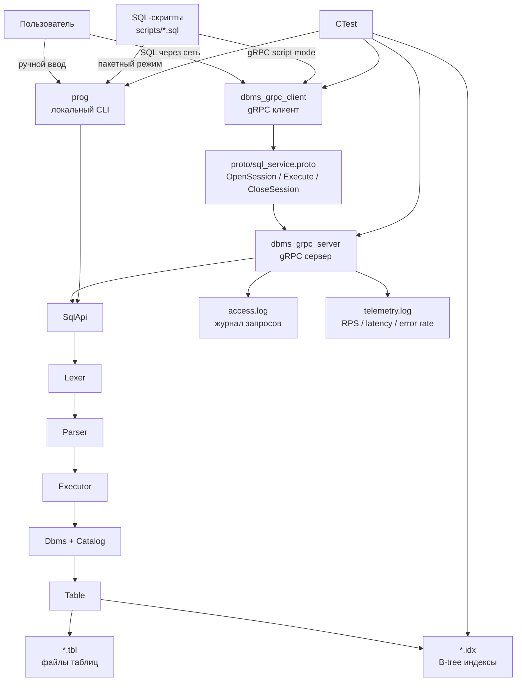

# B-tree-main

Курсовая работа по системному программированию: файловая СУБД на C++ с индексом B-tree.

Вариант индекса: **B-tree**.  
Основная реализация находится в папке `dbms`.

## Что реализовано

Обязательная часть задания:

- двухуровневая структура: база данных -> таблицы;
- типы данных `INT`, `STRING`, `NULL`;
- интерактивный CLI-режим;
- пакетный CLI-режим через SQL-файл;
- SQL-подобные команды `CREATE DATABASE`, `DROP DATABASE`, `USE`;
- команды `CREATE TABLE`, `DROP TABLE`;
- команды `INSERT`, `SELECT`, `UPDATE`, `DELETE`;
- условия `WHERE` с операторами `==`, `!=`, `<`, `>`, `<=`, `>=`;
- `BETWEEN` для диапазонов;
- `LIKE` для строк через регулярные выражения;
- ограничения `NOT NULL` и `INDEXED`;
- автоматическое создание B-tree индекса для `INDEXED` колонок;
- хранение таблиц и индексов на диске;
- вывод результата `SELECT` в JSON;
- синтаксическая и семантическая валидация запросов.

Дополнительные задания:

- **3**: клиент-серверная архитектура через gRPC;
- **7**: Access Logs для запросов к серверу;
- **8**: Telemetry с RPS, временем обработки и error rate;
- **10**: значения по умолчанию `DEFAULT`;
- **11**: составные условия `AND`, `OR`, скобки в `WHERE`;
- **12**: агрегаты `SUM`, `COUNT`, `AVG`.

## Архитектурная схема

GitHub отображает Mermaid-схемы прямо в Markdown.



Коротко по схеме:

- `prog` и `dbms_grpc_server` используют один общий SQL-путь: `SqlApi -> Lexer -> Parser -> Executor`;
- локальный режим выполняет SQL прямо в процессе `prog`;
- gRPC-режим передаёт SQL от клиента к серверу через `Execute`;
- таблицы лежат в бинарных `.tbl`, индексы B-tree лежат в бинарных `.idx`;
- `access.log` и `telemetry.log` создаются только при работе gRPC-сервера;
- тесты проверяют B-tree, SQL, CLI и связку gRPC server/client.

## Структура проекта

```text
B-tree-67/
  README.md
  dbms/
    CMakeLists.txt
    include/dbms/
      core/        # Dbms, Catalog, Database, Table, Schema
      index/       # BTreeDiskIndex, IndexManager, IndexPageManager
      storage/     # страницы таблиц, записи, кодирование, .tbl
      sql/         # Lexer, Parser, Executor, SqlApi, CLI
      grpc/        # gRPC service, logs, telemetry
    src/
      main.cpp
      sql/
      grpc/
    proto/
      sql_service.proto
    scripts/
      demo_point0.sql
      demo_constraints_errors.sql
      demo_restart_seed.sql
      demo_restart_check.sql
      demo_grpc.sql
    tests/
      b_tree_tests.cpp
      sql/
      spec/
      grpc_smoke_test.sh
    build-clang18/
      prog
      dbms_grpc_server
      dbms_grpc_client
```

## Сборка

Готовая рабочая сборка находится в:

```text
dbms/build-clang18
```

Все команды ниже выполняются из папки `dbms`:

```bash
cd /home/flow/Documents/vsc/B-tree-67/dbms
```

Пересобрать основные программы:

```bash
cmake --build build-clang18 --target dbms dbms_grpc_server dbms_grpc_client -j 4
```

Пересобрать программы и тесты:

```bash
cmake --build build-clang18 --target dbms dbms_tests dbms_sql_tests dbms_cli_tests dbms_all_tests dbms_grpc_server dbms_grpc_client -j 4
```

Если нужно заново настроить CMake для текущей сборки:

```bash
cmake -S . -B build-clang18 \
  -DCMAKE_C_COMPILER=/usr/bin/clang-18 \
  -DCMAKE_CXX_COMPILER=/usr/bin/clang++-18 \
  -DFETCHCONTENT_SOURCE_DIR_GRPC="$PWD/build-clang18/_deps/grpc-src" \
  -DFETCHCONTENT_SOURCE_DIR_GOOGLETEST="$PWD/build-clang18/_deps/googletest-src" \
  -DFETCHCONTENT_SOURCE_DIR_NLOHMANN_JSON="$PWD/build-clang18/_deps/nlohmann_json-src"
```

В текущей сборке зависимости уже лежат внутри `build-clang18/_deps`, поэтому повторная пересборка не должна заново скачивать gRPC.

## Хранение данных

Файлы данных создаются не рядом с SQL-скриптами, а в `DATA_ROOT`.

Для обычного CLI путь задаётся переменной окружения:

```bash
export DBMS_DATA_ROOT=/home/flow/Documents/vsc/B-tree-67/dbms/demo_data/show
```

Если `DBMS_DATA_ROOT` не задан, используется путь по умолчанию:

```text
/tmp/coursework_dbms_data
```

В коде это задано в `include/dbms/core/dbms.h`, функция `Dbms::default_data_root()`.

Для gRPC путь задаётся третьим аргументом при запуске сервера:

```bash
./build-clang18/dbms_grpc_server 127.0.0.1:50051 /home/flow/Documents/vsc/B-tree-67/dbms/demo_data/grpc_show
```

Основные файлы данных:

- `.tbl` - бинарный файл таблицы;
- `.idx` - бинарный файл B-tree индекса;
- `access.log` - текстовый журнал gRPC-запросов;
- `telemetry.log` - текстовый журнал метрик gRPC-сервера.

Файлы `.tbl` и `.idx` не предназначены для чтения глазами. Их нужно показывать как доказательство дискового хранения, а содержимое демонстрировать через `SELECT`.

## Запуск локального CLI

Интерактивный режим:

```bash
cd /home/flow/Documents/vsc/B-tree-67/dbms
export DBMS_DATA_ROOT=/tmp/btree67-cli-demo
rm -rf "$DBMS_DATA_ROOT"
./build-clang18/prog
```

Пример ручных команд:

```sql
CREATE DATABASE manual_demo;
USE manual_demo;
CREATE TABLE users (id INT INDEXED, login STRING INDEXED, age INT NOT NULL, city STRING);
INSERT INTO users (id, login, age, city) VALUE (1, "alice", 20, "Amsterdam"), (2, "bob", 25, "Paris");
SELECT * FROM users;
UPDATE users SET age = 26 WHERE id == 2;
SELECT id, login, age FROM users WHERE id >= 1;
DELETE FROM users WHERE login == "alice";
SELECT * FROM users;
quit;
```

Команда выполняется только после символа `;`. Если нажать Enter до `;`, программа продолжит ждать ввод и покажет приглашение `...`.

## Запуск SQL-скриптов

Основной сценарий:

```bash
cd /home/flow/Documents/vsc/B-tree-67/dbms
export DBMS_DATA_ROOT=/tmp/btree67-point0-demo
rm -rf "$DBMS_DATA_ROOT"
./build-clang18/prog scripts/demo_point0.sql
```

Сценарий ошибок:

```bash
export DBMS_DATA_ROOT=/tmp/btree67-errors-demo
rm -rf "$DBMS_DATA_ROOT"
./build-clang18/prog scripts/demo_constraints_errors.sql
```

`demo_constraints_errors.sql` специально завершается с кодом `1`, потому что внутри есть ожидаемые ошибки. Это нормальная часть демонстрации.

## Проверка сохранения после перезапуска

Используется пара скриптов:

- `scripts/demo_restart_seed.sql` - создаёт базу, таблицу и данные;
- `scripts/demo_restart_check.sql` - ничего не создаёт, только читает уже сохранённые данные.

Команды:

```bash
cd /home/flow/Documents/vsc/B-tree-67/dbms
export DBMS_DATA_ROOT=/home/flow/Documents/vsc/B-tree-67/dbms/demo_data/restart_show
rm -rf "$DBMS_DATA_ROOT"

./build-clang18/prog scripts/demo_restart_seed.sql
./build-clang18/prog scripts/demo_restart_check.sql
```

После первого запуска можно открыть папку:

```text
dbms/demo_data/restart_show/demo_restart
```

Там должны быть файлы:

```text
accounts.tbl
accounts__id.idx
accounts__owner.idx
```

Во втором скрипте нет `INSERT`, поэтому если он выводит `alice`, `bob`, `carol`, значит данные прочитаны с диска после нового запуска процесса.

## gRPC client/server

gRPC закрывает дополнительное задание 3: основной функционал вынесен в сервер, а клиент отправляет запросы по сети.

Терминал 1, сервер:

```bash
cd /home/flow/Documents/vsc/B-tree-67/dbms
export GRPC_DATA_ROOT=/home/flow/Documents/vsc/B-tree-67/dbms/demo_data/grpc_show
rm -rf "$GRPC_DATA_ROOT"
./build-clang18/dbms_grpc_server 127.0.0.1:50051 "$GRPC_DATA_ROOT"
```

Терминал 2, клиент со скриптом:

```bash
cd /home/flow/Documents/vsc/B-tree-67/dbms
./build-clang18/dbms_grpc_client 127.0.0.1:50051 scripts/demo_grpc.sql
```

Интерактивный gRPC-клиент:

```bash
./build-clang18/dbms_grpc_client 127.0.0.1:50051
```

Пример команд внутри клиента:

```sql
CREATE DATABASE grpc_manual;
USE grpc_manual;
CREATE TABLE messages (id INT INDEXED, text STRING);
INSERT INTO messages (id, text) VALUE (1, "hello from grpc"), (2, "second");
SELECT id, text FROM messages WHERE id BETWEEN 1 AND 2;
quit;
```

Схема gRPC API описана в:

```text
dbms/proto/sql_service.proto
```

Основные методы:

- `OpenSession` - открыть клиентскую сессию;
- `Execute` - отправить SQL-запрос;
- `CloseSession` - закрыть сессию.

После выполнения запросов можно открыть:

```text
dbms/demo_data/grpc_show/access.log
dbms/demo_data/grpc_show/telemetry.log
```

`access.log` показывает SQL-запросы, пришедшие на сервер.  
`telemetry.log` показывает RPS, среднее время обработки и error rate.

## Несколько gRPC-клиентов

Можно открыть несколько терминалов с клиентом:

```bash
./build-clang18/dbms_grpc_client 127.0.0.1:50051
```

Каждый клиент получает отдельный `session_id`. В `access.log` это видно по разным значениям `client=...`.

SQL-запросы внутри сервера защищены общим `mutex`, поэтому несколько клиентов могут работать одновременно, а сами операции с общей СУБД выполняются безопасно по очереди.


## Тесты

Полный запуск тестов:

```bash
cd /home/flow/Documents/vsc/B-tree-67/dbms
ctest --test-dir build-clang18 --output-on-failure
```

Запуск тестов по отдельности:

```bash
./build-clang18/tests/bin/dbms_tests
./build-clang18/tests/bin/dbms_sql_tests
./build-clang18/tests/bin/dbms_cli_tests
./build-clang18/tests/bin/dbms_all_tests
ctest --test-dir build-clang18 -R grpc_smoke_test --output-on-failure
```

Что покрывают тесты:

- `dbms_tests` - B-tree индекс;
- `dbms_sql_tests` - lexer, parser, executor, constraints, WHERE, DEFAULT, агрегаты;
- `dbms_cli_tests` - пакетный CLI и многострочные команды;
- `dbms_all_tests` - общий сценарный набор по требованиям;
- `grpc_smoke_test` - связку server/client.

