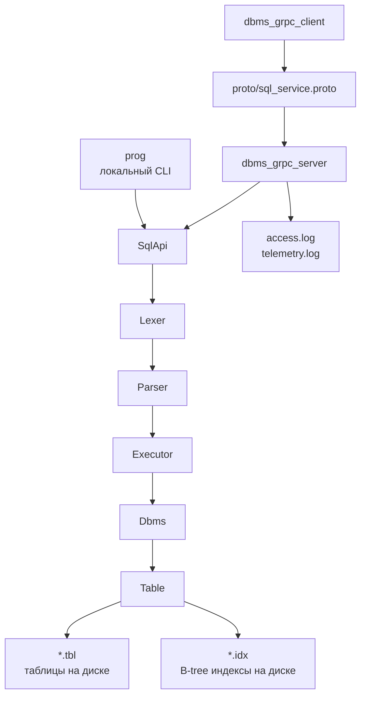

# B-tree

Курсовая работа по системному программированию: файловая СУБД на C++ с SQL-подобным языком запросов и индексом на основе B-tree.

Проект реализует локальную и клиент-серверную работу с базами данных. Таблицы и индексы сохраняются на диске, поэтому данные остаются доступными после завершения программы и повторного запуска.

Основной код находится в папке `dbms`.

## Реализовано

Обязательная часть:

- создание и удаление баз данных;
- выбор активной базы через `USE`;
- создание и удаление таблиц;
- типы данных `INT`, `STRING`, `NULL`;
- ограничения `NOT NULL` и `INDEXED`;
- вставка, выборка, обновление и удаление строк;
- условия `WHERE` с операторами `==`, `!=`, `<`, `>`, `<=`, `>=`;
- `BETWEEN` для диапазонов;
- `LIKE` для строковых шаблонов;
- вывод результатов `SELECT` в JSON;
- хранение таблиц в файлах `.tbl`;
- хранение индексов B-tree в файлах `.idx`;
- автоматическое использование индекса для `INDEXED` колонок;
- интерактивный CLI;
- запуск SQL-скриптов из файла;
- тесты для B-tree, SQL, CLI и общего сценария.

Дополнительные задания:

- задание 3: клиент-серверная архитектура через gRPC;
- задание 7: журнал запросов `access.log`;
- задание 8: телеметрия `telemetry.log` с RPS, временем обработки и error rate;
- задание 10: `DEFAULT` значения в `CREATE TABLE`;
- задание 11: составные условия `AND`, `OR` и скобки в `WHERE`;
- задание 12: агрегаты `SUM`, `COUNT`, `AVG`.

## Структура проекта

```text
B-tree/
  README.md
  dbms/
    CMakeLists.txt
    include/dbms/
      core/        # Dbms, Database, Table, Schema, Catalog
      storage/     # страницы таблиц, записи, кодирование, .tbl
      index/       # BTreeDiskIndex, IndexManager, страницы .idx
      sql/         # Lexer, Parser, Executor, SqlApi, CLI
      grpc/        # gRPC-сервис, access log, telemetry
    src/
      main.cpp
      sql/
      grpc/
    proto/
      sql_service.proto
    scripts/
      demo_point0.sql
      demo_dops.sql
      demo_constraints_errors.sql
      demo_restart_seed.sql
      demo_restart_check.sql
      demo_grpc.sql
    tests/
      b_tree_tests.cpp
      sql/
      spec/
      grpc_smoke_test.sh
```

После сборки в `dbms/build` появляются:

```text
prog
dbms_grpc_server
dbms_grpc_client
tests/bin/dbms_tests
tests/bin/dbms_sql_tests
tests/bin/dbms_cli_tests
tests/bin/dbms_all_tests
```

## Архитектура



Обычный CLI и gRPC-сервер используют один общий путь выполнения SQL:

```text
SqlApi -> Lexer -> Parser -> Executor -> Dbms -> Table -> Storage/Index
```

Лексер разбивает SQL на токены. Парсер строит внутренние структуры команд. Executor проверяет смысл запроса и выполняет операции над базой данных. Таблица хранит строки в `.tbl`, а для `INDEXED` колонок создаёт и обновляет B-tree индекс в `.idx`.

## Сборка

Команды выполняются из папки `dbms`:

```bash
cd /Users/sedimav/Desktop/B-tree-main/dbms
```

Настройка CMake:

```bash
GIT_CONFIG_GLOBAL=/dev/null cmake -S . -B build
```

`GIT_CONFIG_GLOBAL=/dev/null` нужен на этом компьютере, чтобы зависимости скачивались по `https`, а не через `git@github.com`. Без этого gRPC может не скачаться с ошибкой `Permission denied (publickey)`.

Сборка программ и тестов:

```bash
cmake --build build --target dbms dbms_tests dbms_sql_tests dbms_cli_tests dbms_all_tests dbms_grpc_server dbms_grpc_client -j 4
```

На macOS проект собирается обычным AppleClang из Xcode Command Line Tools. Отдельно указывать другой компилятор не нужно.

## Быстрая проверка

Полный запуск тестов:

```bash
cd /Users/sedimav/Desktop/B-tree-main/dbms
ctest --test-dir build --output-on-failure
```

Ожидаемый результат:

```text
100% tests passed, 0 tests failed out of 5
```

Отдельные тесты:

```bash
./build/tests/bin/dbms_tests
./build/tests/bin/dbms_sql_tests
./build/tests/bin/dbms_cli_tests
./build/tests/bin/dbms_all_tests
ctest --test-dir build -R grpc_smoke_test --output-on-failure
```

Назначение тестов:

- `dbms_tests` проверяет B-tree индекс;
- `dbms_sql_tests` проверяет lexer, parser и executor;
- `dbms_cli_tests` проверяет запуск SQL-скриптов;
- `dbms_all_tests` проверяет общий сценарий по требованиям;
- `grpc_smoke_test` проверяет связку gRPC server/client.

## Локальный CLI

Интерактивный режим:

```bash
cd /Users/sedimav/Desktop/B-tree-main/dbms
export DBMS_DATA_ROOT=/tmp/btree-cli-demo
./build/prog
```

Пример команд:

```sql
CREATE DATABASE manual_demo;
USE manual_demo;
CREATE TABLE users (id INT INDEXED, login STRING INDEXED, age INT NOT NULL, city STRING);
INSERT INTO users (id, login, age, city) VALUE
  (1, "alice", 20, "Amsterdam"),
  (2, "bob", 25, "Paris");
SELECT * FROM users;
UPDATE users SET age = 26 WHERE id == 2;
SELECT id, login, age FROM users WHERE id >= 1;
DELETE FROM users WHERE login == "alice";
SELECT * FROM users;
quit;
```

Команда выполняется после символа `;`. Если строка введена без `;`, программа продолжает ждать продолжение команды.

## Запуск SQL-скриптов

Основной сценарий обязательной части:

```bash
cd /Users/sedimav/Desktop/B-tree-main/dbms
export DBMS_DATA_ROOT=/tmp/btree-point0-demo
./build/prog scripts/demo_point0.sql
```

Сценарий дополнительных заданий:

```bash
export DBMS_DATA_ROOT=/tmp/btree-dops-demo
./build/prog scripts/demo_dops.sql
```

Сценарий ошибок:

```bash
export DBMS_DATA_ROOT=/tmp/btree-errors-demo
./build/prog scripts/demo_constraints_errors.sql
```

`demo_constraints_errors.sql` специально содержит некорректные операции. Если программа выводит ошибки для этого файла, это нормальная часть проверки ограничений.

## Хранение на диске

Путь к данным в локальном режиме задаётся переменной:

```bash
export DBMS_DATA_ROOT=/Users/sedimav/Desktop/B-tree-main/dbms/demo_data/show
```

Если переменная не задана, используется путь по умолчанию:

```text
/tmp/coursework_dbms_data
```

Файлы хранения:

- `.tbl` - бинарный файл таблицы;
- `.idx` - бинарный файл B-tree индекса;
- `access.log` - журнал запросов gRPC-сервера;
- `telemetry.log` - журнал метрик gRPC-сервера.

Файлы `.tbl` и `.idx` являются бинарными. Их не нужно читать вручную как текст. Их наличие показывает, что данные и индексы действительно находятся на диске, а содержимое проверяется через `SELECT`.

## Проверка персистентности

Первый скрипт создаёт базу, таблицу и записи:

```bash
cd /Users/sedimav/Desktop/B-tree-main/dbms
export DBMS_DATA_ROOT=/Users/sedimav/Desktop/B-tree-main/dbms/demo_data/restart_show
./build/prog scripts/demo_restart_seed.sql
```

Второй скрипт запускается отдельно и только читает уже сохранённые данные:

```bash
./build/prog scripts/demo_restart_check.sql
```

После первого запуска в папке данных должны появиться файлы:

```text
demo_restart/accounts.tbl
demo_restart/accounts__id.idx
demo_restart/accounts__owner.idx
```

Если второй запуск выводит записи `alice`, `bob`, `carol`, значит данные были прочитаны с диска после перезапуска программы.

## gRPC режим

gRPC режим нужен для дополнительного задания 3. Сервер хранит данные и выполняет SQL, клиент отправляет запросы по сети.

Терминал 1, запуск сервера:

```bash
cd /Users/sedimav/Desktop/B-tree-main/dbms
export GRPC_DATA_ROOT=/Users/sedimav/Desktop/B-tree-main/dbms/demo_data/grpc_show
./build/dbms_grpc_server 127.0.0.1:50051 "$GRPC_DATA_ROOT"
```

Терминал 2, запуск клиента со скриптом:

```bash
cd /Users/sedimav/Desktop/B-tree-main/dbms
./build/dbms_grpc_client 127.0.0.1:50051 scripts/demo_grpc.sql
```

Интерактивный gRPC-клиент:

```bash
./build/dbms_grpc_client 127.0.0.1:50051
```

Пример команд:

```sql
CREATE DATABASE grpc_manual;
USE grpc_manual;
CREATE TABLE messages (id INT INDEXED, text STRING);
INSERT INTO messages (id, text) VALUE (1, "hello from grpc"), (2, "second");
SELECT id, text FROM messages WHERE id BETWEEN 1 AND 2;
quit;
```

Описание сетевого API находится в:

```text
dbms/proto/sql_service.proto
```

Основные методы:

- `OpenSession` открывает клиентскую сессию;
- `Execute` выполняет SQL-запрос;
- `CloseSession` закрывает сессию.

После работы сервера можно проверить:

```text
dbms/demo_data/grpc_show/access.log
dbms/demo_data/grpc_show/telemetry.log
```

`access.log` показывает запросы, которые пришли на сервер.  
`telemetry.log` показывает RPS, среднее время обработки запроса и долю ошибок.

## SQL, который поддерживается

DDL:

```sql
CREATE DATABASE name;
DROP DATABASE name;
USE name;
CREATE TABLE table_name (...);
DROP TABLE table_name;
```

DML:

```sql
INSERT INTO table_name (...) VALUE (...), (...);
SELECT * FROM table_name WHERE ...;
UPDATE table_name SET column = value WHERE ...;
DELETE FROM table_name WHERE ...;
```

Ограничения и модификаторы:

```sql
id INT INDEXED
name STRING NOT NULL
status STRING DEFAULT "new"
```

Условия:

```sql
id == 1
age BETWEEN 18 AND 25
login LIKE "a.*"
(amount >= 100 AND status == "new") OR id == 4
```

Агрегаты:

```sql
SELECT COUNT(id), SUM(amount), AVG(amount) FROM orders;
```

## Что показать на сдаче

1. Собрать проект через `cmake`.
2. Запустить `ctest --test-dir build --output-on-failure`.
3. Запустить `scripts/demo_point0.sql` и показать базовые SQL-операции.
4. Запустить `scripts/demo_dops.sql` и показать дополнительные задания `DEFAULT`, `AND/OR`, агрегаты.
5. Запустить `demo_restart_seed.sql`, затем `demo_restart_check.sql` и показать, что данные сохранились между запусками.
6. Открыть папку данных и показать файлы `.tbl` и `.idx`.
7. Запустить gRPC-сервер и клиент.
8. Показать `access.log` и `telemetry.log`.

Главная идея проекта: SQL-запрос проходит через lexer, parser и executor, после чего executor работает с файловой СУБД. Таблица хранится в `.tbl`, а индексированные колонки используют B-tree индекс в `.idx`.
